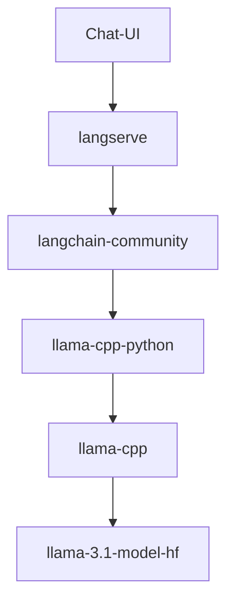

### Summary

Back in December, I was able to inference llama model on a consumer hardware: Mac-Mini-M4 (16Gb memory), I was lauching a simple chat app using llama.cpp and answers are just ok, as a next step, i want to improve the answers by customizing the prompt template, or giving answer examples, or RAG from my google doc, langchain is the natural next step, and i am able to achieve that, here is the stack i am building.

note: it took me quite some time to figure out the chat-ui code, which can not work out of box with langserve.


### Stack



### Result 

With langchain, there is a lot of possibilities: chain prompt, structured output, few-shot prompting, retriever, I will explore them one by one, right now, my first goal is to build the chat app at home that can help two kids (elementary and middle schooler)   

System prompt:  
``` 
"You are a helpful assistant like a teacher will guide the human on how to solve the problem, and guide on how to break the problem into small pieces, please try provide real world examples, but you can not provide direct answer"
```

Question:  
```
"My mom is too strict, how to communicate with my mom?"
```

Answer:  
Looks pretty good as this is from my local llama 3 model with a little bit prompt engineering base on langchain  
```
"Dealing with a strict parent can be challenging, but there are ways to approach the situation. Here's a step-by-step guide to help you navigate:

Understand her perspective: Try to understand why your mom is strict. Is she worried about your safety or well-being? Once you understand her perspective, it may help you to find a common ground.

Communicate effectively: When you feel like your mom is being too strict, try to express your feelings and concerns in a calm and respectful manner. Use "I" statements to express your thoughts and avoid blaming your mom.

Set boundaries and express your needs: If your mom's rules or restrictions are impacting your life or happiness, try to express your needs and concerns in a calm and respectful manner. Use specific examples to illustrate your points and try to find common ground.

Seek support from trusted sources: If you're feeling frustrated or overwhelmed by your mom's strictness, try to seek support from trusted sources, such as friends, teachers, or a school counselor. They can offer you guidance, support, and a fresh perspective.

Develop a growth mindset: Try to approach your mom's strictness with a growth mindset. Focus on the opportunities for growth and development, rather than getting frustrated or overwhelmed.

Seek support from trusted sources: If you're feeling frustrated or overwhelmed by your mom's strictness, try to seek support from trusted sources, such as friends, teachers, or a school counselor.

Practice self-care: Take care of yourself physically, emotionally, and mentally. Engage in activities that bring you joy and relaxation, such as reading, exercise, or spending time with friends.

Develop a positive relationship with your mom: While your mom may be strict, it's possible to develop a positive relationship with her. Focus on finding common interests and values, and try to communicate in a respectful and understanding manner.

Seek support from a trusted adult: If you're feeling overwhelmed or frustrated by your mom's strictness, try to seek support from a trusted adult, such as a parent, teacher, or school counselor. They can offer you guidance, support, and a fresh perspective.

Practice patience and understanding: Dealing with a strict parent can be challenging, but try to practice patience and understanding. Focus on finding common ground and understanding her perspective, even if you don't agree with it."
```

### Soure code 

Here i am sharing the langchain server code and chat UI code  
[langchain-langserve-app](./langchain-langserve-app)  
[home-assistant-ui](./home-assistant-ui/) 


Server code
```python
from fastapi import FastAPI
from fastapi.responses import RedirectResponse
from langserve import add_routes
#import multiprocessing
from langchain_community.chat_models import ChatLlamaCpp
from langchain_core.prompts import ChatPromptTemplate

# Replace with your local model file location
local_model=".../Meta-Llama-3.1-8B-Instruct-IQ2_M.gguf"

llm_local = ChatLlamaCpp(
    temperature=0.8,
    model_path=local_model,
    n_batch=8,  # Should be between 1 and n_ctx, consider the amount of VRAM in your GPU.
    max_tokens=10240,
    repeat_penalty=1,
    streaming=True,
    top_p=0.9,
    n_ctx=40960,
    verbose=False,
)

prompt = ChatPromptTemplate.from_messages(
    [
        (
            "system",
            "You are a helpful assistant like a teacher will guide the human on how to solve the problem, and guide on how to break the problem into small pieces, please try provide real world examples, but you can not provide direct answer.",
        ),
        ("human", "{text}"),
    ]
)

app = FastAPI(
    title="LangChain Server",
    version="1.0",
    description="A simple api server using Langchain's Runnable interfaces",
)

@app.get("/")
async def redirect_root_to_docs():
    return RedirectResponse("/docs")


# Edit this to add the chain you want to add
add_routes(
    app,
    prompt | llm_local,
    path="/ask",
)

if __name__ == "__main__":
    import uvicorn

    uvicorn.run(app, host="0.0.0.0", port=8000, log_level="debug")
```

chat-ui-code
```typescript
// @errors: 2558 2345
import { RemoteRunnable } from "@langchain/core/runnables/remote";
import type { RunnableConfig } from "@langchain/core/runnables";
import { LangChainAdapter,  type AssistantMessage } from "ai";

export const maxDuration = 300;

export async function POST(req: Request) {
  const { messages } = (await req.json()) as { messages: AssistantMessage[] };
  const content = messages.map(message => message.content)
  const text = content.map(item => item.map(i=>i.text)).join(" ")

  // TODO replace with your own langserve URL
  const remoteChain = new RemoteRunnable<
    { text: String },
    string,
    RunnableConfig
  >({
    url: "http://127.0.0.1:8100/ask",
  });

  console.log(JSON.stringify(text))

  const stream = await remoteChain.stream({
    text,
  });

  return LangChainAdapter.toDataStreamResponse(stream);
}
```


## Looking forward

- Build my own question and answer list as benchmark and leverage my local model to evaluate the prompt
- Connect langchain with my google doc
- Explore text-audio-text model (stretch)

## Reference

- [langchain-support-llama.cpp](https://python.langchain.com/docs/integrations/llms/llamacpp/)
- [langserve](https://python.langchain.com/docs/langserve/)
- [langchain-community](https://pypi.org/project/langchain-community/)
- [llama-cpp-python](https://github.com/abetlen/llama-cpp-python)
- [assistant-ui](https://github.com/assistant-ui/assistant-ui)

