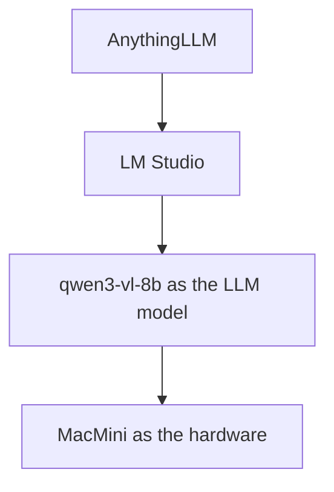

# Let your local LLM really understand you

You can achieve the personal understanding via RAG, Because it is a local LLM, the data never need to go out.

All you need is: LM Studio + AnythingLLM + Docs about you

# Reference
1. https://lmstudio.ai/
2. https://anythingllm.com/
3. https://qwen.ai/blog?id=qwen3-vl
